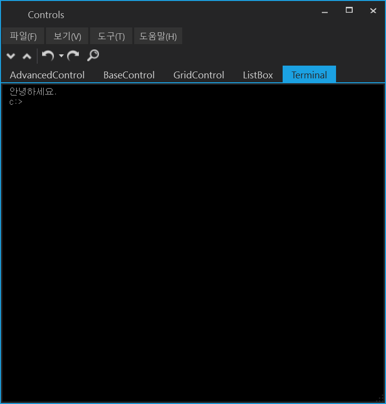

# font-generator

modern-ui is wpf based framework for crema that is development tool for game data.

## Development Environment

### [Microsoft Visual Studio Community 2019](https://visualstudio.microsoft.com/ko/downloads/) or [Microsoft Visual Studio Code](https://code.visualstudio.com/)

### [.NET Core 3.1](https://dotnet.microsoft.com/download/dotnet-core/3.1)

## Build an Run

    git clone https://github.com/s2quake/modern-ui --recursive
    cd modern-ui
    dotnet restore
    dotnet build --framework netcoreapp3.1 --configuration Release
    dotnet run --framework netcoreapp3.1 --configuration Release --project ./JSSoft.ModernUI.Framework/JSSoft.ModernUI.Shell

# Screenshots

